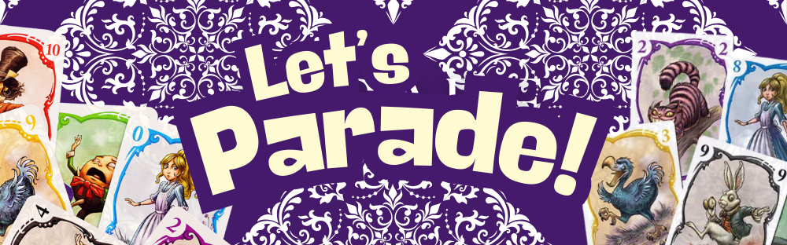

# 🎭 Parade Card Game (G2T5)

*Presenting the popular card game, Parade, to your console!*


Parade is a strategic card game where players try avoiding taking cards from it to finish with the lowest score.  Our implementation focuses on game logic and straightforward console interaction using Nielson's Usability Heuristics for Design, based on the official rules.

---

## 👥 Parade Creators

1.  KHOO KAR XING
2.  GOH WOON HONG RAYNER
3.  TAM KAI ZE
4.  ERNEST NG CHEN YI
5.  WINDY HENG HUI YI
6.  CHAI YI KHUEN

---

## 📜 Parade Principles

The complete game mechanics are detailed in the [official rulebook](https://cdn.1j1ju.com/medias/8f/7e/8f-parade-rulebook.pdf). 🎪✨


## ⏳ Timed Mode Rules

In **Timed Mode**, players must act swiftly — the Parade doesn’t wait!

- 🕐 **Fast Hands Get Rewarded**: Receive bonus points from fast moves at the end of every turn! Variable bonus points are awarded based on how fast players make their moves and conclude their turns.
- ⌛ **Weighted Bonus**: To ensure that you maintain a steady balance of swiftness and skill, the final score weighs your accumulated speed bonus points and the raw score to produce an aggregated final score at the end. Just being fast is not enough, make sure to execute your moves strategically as well!
- 📉 **Higher Stakes, Better Scores**: All other standard rules apply, but with an added twist — time is of the essence, tick tock. DO you think you have what it takes to be the fastest fingers in the Parade?
---


---

## ✨🎉 Parade Extras — Add-on Features

To bring even more excitement and color to the already whimsical world of **Parade**, we've added a host of extra features that keep the fun going beyond the base game!

- 🎭 **Account System**: Keep track of your Parade journey! Your progress, flair, and statistics are all safely stored under your player account.
- 🤝 **Multiplayer Mode**: Host or join games with friends over the same network and compete to see whose parade will prevail!
- 🛍️ **In-Game Shop**: Spend your hard-earned Parade Points on flairs, themes, and other customizations to truly stand out in style.
- ⏱️ **Timed Gamemodes**: For players who like their parades *fast and furious*! Test your reflexes in a race against the clock.
- 🧠 **Computer Opponents**: Challenge AI players of two difficulty levels — whether you're a beginner or a seasoned Parade master, there's always a worthy rival.

---

Let me know if you'd like a visual scoreboard mock-up or a UI blurb added too!

## ▶️ Playing Parade

Prerequisites:
💡 You need a Java Development Kit (JDK) installed to compile and run the game.

**NOTE:** The game is playable on any device, but for the best experience, we recommend running it on a unix shell.

Also, use `Ctrl +` or `Ctrl -` to zoom in or out and center the Parade display for a more balanced and immersive game display.

1. Compile the Java Code:

Open your terminal or command prompt in the project directory and run the below compile script:

```bash
compile.bat # For Windows
compile.sh # For MacOS and Linux
```
2. Run the Game:

In the same terminal window, run the start script:

```bash
run.bat # For Windows
run.sh #For MacOS and Linux
```

Source code
💡 Note: All source codes (`.java` files) are located in `src`.

---

### 🧱 UML Diagram
We prepared a [UML diagram](https://drive.google.com/drive/folders/1jFY1PGtcB7KkmPBxeT8U-llyymSqHPKe?usp=drive_link) to illustrate the relationships of the classes and how they are organized.

---

### 🔁 Sequence Diagram
For those interested in the program's flow, we've provided sequence diagram files under `docs` that show how different parts of the code interact during gameplay. It helps visualize the process from playing a card to calculating scores.
To view the sequence diagrams, please install the VS Code Extention [PlantUML](https://marketplace.visualstudio.com/items?itemName=jebbs.plantuml).


